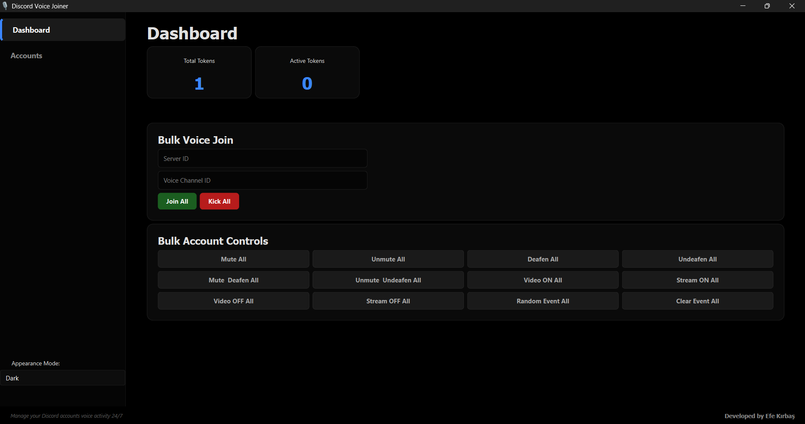
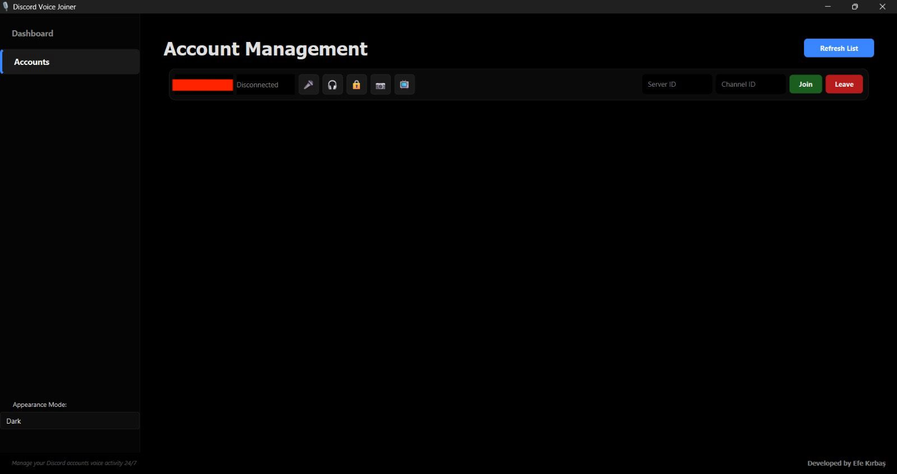
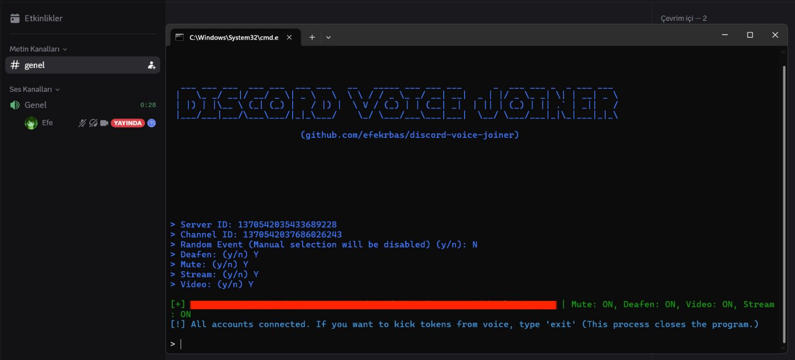

#  Discord Voice Joiner


**Keep your Discord accounts active in voice channels 24/7**

**Discord Voice Joiner** is a modern, high-performance dashboard designed to manage multiple Discord accounts simultaneously in voice channels. Fully compliant with April 2026 security protocols.

## 📸 Screenshots

### GUI



### CLI Interface


## 🚀 Key Features

- **Modern PyQt6 Interface:** Fluid, fast, and stable desktop experience.
- **Dynamic Theme Support:**
  - **AMOLED Black:** Deep black (#000000) design optimized for OLED displays.
  - **Full White:** A clean and bright workspace.
- **April 2026 Integrity Patch:**
  - `Build 522553` synchronization.
  - `X-Discord-Fingerprint` automatic experiment fetching.
  - API v10 protocol support.
- **Advanced Bulk Controls:**
  - One-click Join, Kick, and Stop for all tokens.
  - Bulk Mute and Deafen parameters.
  - Bulk Camera (Video) and Stream (Go Live) toggles.
  - **Random Event Engine:** Individually assigns independent voice features across active tokens.
  - **Clear Event:** Instantly resets combinations back to primary modes.
- **Individual Account Management:** Detailed control for each account, status monitoring, and channel switching.

## 🛠️ Installation

1. Ensure Python 3.10+ is installed.
2. Add your Discord tokens to `tokens.txt` in the main folder.
3. Choose your interface below and run the installation script.

## 📋 Usage Methods

### 1. Dashboard Mode (GUI)
A modern and visual interface with full control over all accounts.

- **Setup:** Navigate to the `gui` folder and run `install.bat` (Windows) or `install.sh` (Linux/macOS).
- **Launch:** Run `main.pyw` for a clean, windowed experience:
  ```bash
  cd gui
  python main.pyw
  ```
- **Features:** 
  - Manage account status with a live dashboard.
  - Bulk controls for Join/Stop, Mute, Deafen, and Stream.
  - Theme support (AMOLED Black / Full White).

### 2. Command Line Mode (CLI)
A lightweight and performance-driven terminal interface, ideal for VDS/VPS environments.

- **Setup:** Navigate to the `cli` folder and run `install.bat` (Windows) or `install.sh` (Linux/macOS).
- **Launch:** Run `main.py` and enter your Server ID and Channel ID when prompted:
  ```bash
  cd cli
  python main.py
  ```
- **Features:**
  - Lightweight interactive terminal mode.
  - Supports custom configuration prompts for **Deafen**, **Mute**, **Stream (Go Live)**, and **Video**.
  - **New:** Per-token channel configuration (choose to join all to one channel or assign channels individually).
  - Smooth typewrite login logs with zero duplicate prints.
  - Minimal resource usage & fast connection loop with auto-reconnect.
  - Optimized for 24/7 uptime in terminal environments with an instant exit system.


## ⚠️ Important Notes

- It is recommended that accounts be phone or email verified for joining servers smoothly.
- Thanks to April 2026 updates, the "Update your application" error has been resolved by 99%.

## ⚡ 24/7 Uptime Recommendations

- **Stable Internet:** A wired connection (Ethernet) is highly recommended for long-term stability.
- **Power Settings:** Disable "Sleep" and "Hibernate" modes on your Windows PC to prevent the application from pausing.
- **VDS/VPS Usage:** For 100% uptime without leaving your personal computer on, running this tool on a Virtual Private Server (VPS) is recommended.
- **Auto-Reconnect:** The application includes a built-in recovery loop that automatically restores account connections after network fluctuations or Discord gateway resets.

---
**Developed by Parth**
